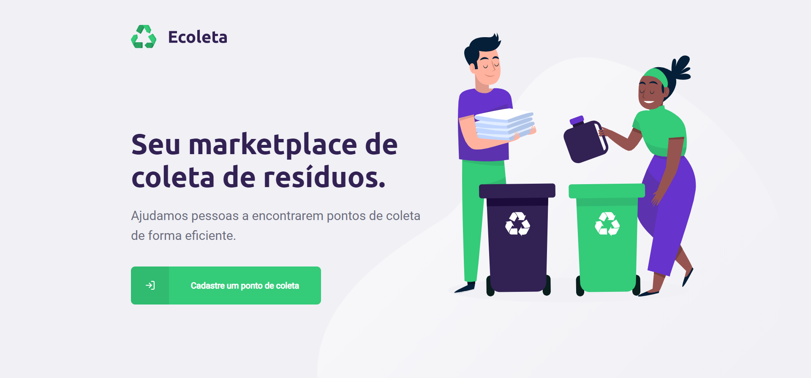

<h1 align="center">
    
</h1>

<h4 align="center"> 
	NextLevelWeek 1.0 🚀
</h4>

<p align="center">
  

  	
  
  <a href="https://github.com/Oppadayo/ecoleta/commits/master">
    
  </a>

  
   <a href="https://github.com/Oppadayo/ecoleta/stargazers">
    
  </a>
</p>


## 💻 Sobre o projeto

♻️ Ecoleta - é uma forma de conectar empresas e entidades de coleta de resíduos orgânicos e inorgânicos as pessoas que precisam descartar seus resíduos de maneira ecológica.

As empresas ou entidades poderão se cadastrar na plataforma web enviando:
- uma imagem do ponto de coleta
- nome da entidade, email e whatsapp
- e o endereço para que ele possa aparecer no mapa
- além de selecionar um ou mais ítens de coleta: 
  - lâmpadas
  - pilhas e baterias
  - papéis e papelão
  - resíduos eletrônicos
  - resíduos orgânicos
  - óleo de cozinha

Os usuários terão acesso ao aplicativo móvel, onde poderão:
- navegar pelo mapa para ver as instituições cadastradas
- entrar em contato com a entidade através do E-mail ou do WhatsApp

Projeto desenvolvido durante a **NLW - Next Level Week** oferecida pela [Rocketseat].
O NLW é uma experiência online com muito conteúdo prático, desafios e hacks onde o conteúdo fica disponível durante uma semana.


## 🎨 Layout

O layout da aplicação está disponível no Figma:

<a href="https://www.figma.com/file/1SxgOMojOB2zYT0Mdk28lB/Ecoleta?node-id=136%3A546">
  
</a>


### Mobile

<p align="center">
  

  
</p>

### Web

<p align="center" style="display: flex; align-items: flex-start; justify-content: center;">
  

  
</p>

## 🛠 Tecnologias

As seguintes ferramentas foram usadas na construção do projeto:

- [Expo][expo]
- [Node.js][nodejs]
- [React][reactjs]
- [React Native][rn]
- [TypeScript][typescript]


## 🚀 Como executar o projeto

Podemos considerar este projeto como sendo divido em três partes:
1. Back End (pasta server) 
2. Front End (pasta web)
3. Mobile (pasta mobile)

💡Tanto o Front End quanto o Mobile precisam que o Back End esteja sendo executado para funcionar.

### Pré-requisitos

Antes de começar, você vai precisar ter instalado em sua máquina as seguintes ferramentas:
[Git](https://git-scm.com), [Node.js][nodejs]. 
Além disto é bom ter um editor para trabalhar com o código como [VSCode][vscode]

### 🎲 Rodando o Back End (servidor)

```bash
# Clone este repositório
$ git clone https://github.com/Oppadayo/ecoleta

# Acesse a pasta do projeto no terminal/cmd
$ cd ecoleta

# Vá para a pasta server
$ cd server

# Instale as dependências
$ npm install

# Execute a aplicação em modo de desenvolvimento
$ npm run dev

# O servidor inciará na porta:3333 - acesse http://localhost:3333 
```

### 🧭 Rodando a aplicação web (Front End)

```bash
# Clone este repositório
$ git clone https://github.com/Oppadayo/ecoleta

# Acesse a pasta do projeto no seu terminal/cmd
$ cd ecoleta

# Vá para a pasta da aplicação Front End
$ cd web

# Instale as dependências
$ npm install

# Execute a aplicação em modo de desenvolvimento
$ npm start

# A aplicação será aberta na porta:3000 - acesse http://localhost:3000
```

### 🧭 Rodando a aplicação mobile (Mobile)

```bash
# Clone este repositório
$ git clone https://github.com/Oppadayo/ecoleta

# Acesse a pasta do projeto no seu terminal/cmd
$ cd ecoleta

# Vá para a pasta da aplicação Front End
$ cd mobile

# Instale as dependências
$ npm install

# Execute a aplicação em modo de desenvolvimento
$ npm start

# A aplicação será aberta na 19001 - Ela abre uma aba com as opções de rodar a aplicação no emulador ou no celular usando o QR code
```

### ToDos
- [ ] Mascara para o whatsapp.
- [ ] Select na busca mobile.
- [ ] Mostrar quando der erro ao cadastrar ponto de coleta.
- [ ] Tirar do mapa pontos de coleta quando itens não estiverem mais selecionados. 
- [ ] Layout web responsivo  
